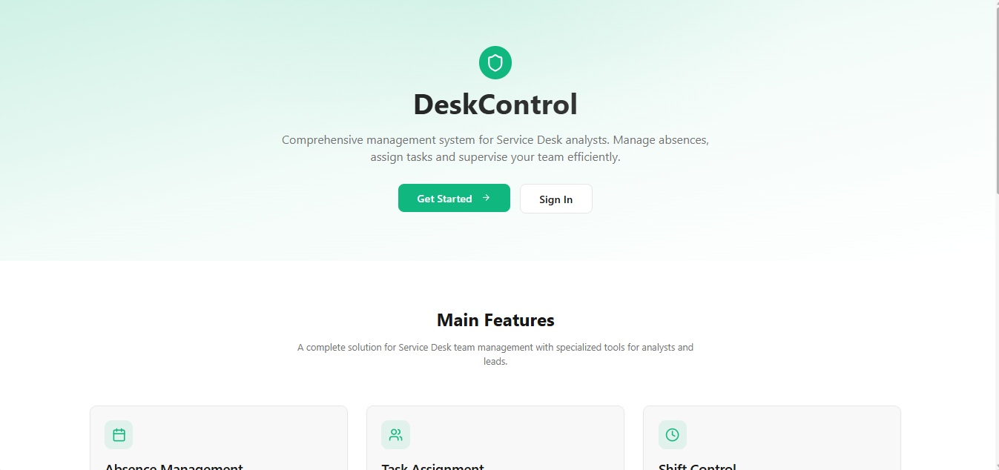

# 🖥️ Desk Control

Operational management application for Service Desk teams — shift scheduling, absence requests (with approval and cancellation flows), and task assignments for Leads and Analysts.

🔗 **Live demo:** [https://tranquil-syrniki-a20c8e.netlify.app/]


<!-- Replace with a real screenshot of the dashboard -->

---

## 🇬🇧 English

### About the project
Desk Control is an internal tool built to help Service Desk teams organize themselves: analysts can see each other's schedules, request time off, self-assign tasks, and leads can review and approve requests, assign tasks, and manage the team calendar. Access and permissions differ by role (Admin, Lead, Analyst), enforced with Supabase Row Level Security.

**A note on how this was built:** this project was developed as part of an AI-assisted development program ("vibecoding") at my company, using Lovable together with Supabase. I worked through the database design, role-based access rules, and debugging of RLS policies directly — the migration history in `supabase/migrations` shows that iterative process. I'm comfortable explaining any part of this codebase.

### Features
- Role-based dashboards for Admin, Lead and Analyst
- Shift management: workdays, start/end times, lunch and break schedules, office/home mode
- Absence request workflow: submission, approval/rejection, and cancellation requests
- Task assignment by Leads, plus self-assignment for Analysts
- Team calendar showing shifts and approved absences
- Avatar upload via Supabase Storage
- Row Level Security policies enforcing role-based data access at the database level

### Tech stack
- React + TypeScript
- Vite
- Tailwind CSS + shadcn/ui
- react-router-dom
- react-hook-form + zod
- Supabase (PostgreSQL, Auth, Storage, Row Level Security)

### Running locally
```bash
git clone https://github.com/GabriellyFerreiraa/desk-control.git
cd desk-control
npm install
npm run dev
```
The app runs at `http://localhost:5173`. This project connects to a live Supabase project for authentication and data, so a working connection and valid credentials are required for full functionality.

---

## 🇪🇸 Español

### Sobre el proyecto
Desk Control es una herramienta interna creada para ayudar a los equipos de Service Desk a organizarse: los analistas pueden ver los horarios de sus compañeros, solicitar ausencias, autoasignarse tareas, y los leads pueden revisar y aprobar solicitudes, asignar tareas y gestionar el calendario del equipo. Los permisos varían según el rol (Admin, Lead, Analyst), reforzados con Row Level Security de Supabase.

**Una nota sobre cómo se construyó:** este proyecto fue desarrollado como parte de un programa de desarrollo asistido por IA ("vibecoding") en mi empresa, usando Lovable junto con Supabase. Trabajé directamente en el diseño de la base de datos, las reglas de acceso por rol y la depuración de las políticas de RLS — el historial de migraciones en `supabase/migrations` muestra ese proceso iterativo. Puedo explicar con confianza cualquier parte de este código.

### Funcionalidades
- Dashboards según el rol para Admin, Lead y Analyst
- Gestión de turnos: días laborales, horarios de entrada/salida, almuerzo y descansos, modo oficina/casa
- Flujo de solicitud de ausencias: envío, aprobación/rechazo y solicitudes de cancelación
- Asignación de tareas por parte de los Leads, además de autoasignación para los Analysts
- Calendario de equipo con turnos y ausencias aprobadas
- Subida de avatar mediante Supabase Storage
- Políticas de Row Level Security que refuerzan el acceso a los datos según el rol, a nivel de base de datos

### Tecnologías utilizadas
- React + TypeScript
- Vite
- Tailwind CSS + shadcn/ui
- react-router-dom
- react-hook-form + zod
- Supabase (PostgreSQL, Auth, Storage, Row Level Security)

### Cómo ejecutar localmente
```bash
git clone https://github.com/GabriellyFerreiraa/desk-control.git
cd desk-control
npm install
npm run dev
```
La app corre en `http://localhost:5173`. Este proyecto se conecta a un proyecto real de Supabase para autenticación y datos, por lo que se necesita una conexión funcional y credenciales válidas para el funcionamiento completo.

---

## 🇧🇷 Português

### Sobre o projeto
Desk Control é uma ferramenta interna criada pra ajudar times de Service Desk a se organizarem: analistas conseguem ver o horário uns dos outros, solicitar ausências, se auto-atribuir tarefas, e os leads conseguem revisar e aprovar pedidos, atribuir tarefas e gerenciar o calendário da equipe. As permissões variam por papel (Admin, Lead, Analyst), reforçadas com Row Level Security do Supabase.

**Uma nota sobre como isso foi construído:** esse projeto foi desenvolvido como parte de um programa de desenvolvimento assistido por IA ("vibecoding") na minha empresa, usando Lovable junto com Supabase. Trabalhei diretamente no desenho do banco de dados, nas regras de acesso por papel e na depuração das políticas de RLS — o histórico de migrations em `supabase/migrations` mostra esse processo iterativo. Me sinto segura explicando qualquer parte desse código.

### Funcionalidades
- Dashboards diferentes por papel: Admin, Lead e Analyst
- Gestão de turnos: dias de trabalho, horário de entrada/saída, almoço e intervalos, modo escritório/home office
- Fluxo de solicitação de ausência: envio, aprovação/rejeição e pedidos de cancelamento
- Atribuição de tarefas pelos Leads, além de auto-atribuição pelos Analysts
- Calendário de equipe mostrando turnos e ausências aprovadas
- Upload de avatar via Supabase Storage
- Políticas de Row Level Security reforçando o acesso aos dados por papel, direto no banco de dados

### Tecnologias utilizadas
- React + TypeScript
- Vite
- Tailwind CSS + shadcn/ui
- react-router-dom
- react-hook-form + zod
- Supabase (PostgreSQL, Auth, Storage, Row Level Security)

### Como rodar localmente
```bash
git clone https://github.com/GabriellyFerreiraa/desk-control.git
cd desk-control
npm install
npm run dev
```
O app roda em `http://localhost:5173`. Esse projeto se conecta a um projeto real do Supabase pra autenticação e dados, então é preciso ter conexão funcionando e credenciais válidas pro funcionamento completo.

---

## 📂 Project Structure

```
src/
 ├─ components/
 │   ├─ dashboard/          # LeadDashboard, AnalystDashboard
 │   ├─ forms/              # Absence, Shift, Task forms
 │   ├─ modals/             # Approval and cancellation modals
 │   ├─ calendar/           # Team calendar view
 │   ├─ background/         # Visual effects
 │   └─ ui/                 # shadcn/ui component wrappers
 ├─ hooks/                  # useAuth, use-toast, use-mobile
 ├─ integrations/supabase/  # Supabase client & generated types
 ├─ pages/                  # Route-level pages (Auth, Dashboard, Settings...)
 ├─ lib/                    # Helpers
 ├─ App.tsx                 # Routes
 ├─ main.tsx                # App entry point
supabase/
 └─ migrations/             # Database schema & RLS policy history
```

---

## 👩‍💻 Author / Autora

**Gabrielly Ferreira**
📫 gabiferreira101@gmail.com
🔗 [LinkedIn](https://www.linkedin.com/in/gabrielly-ferreira-619609113/)
